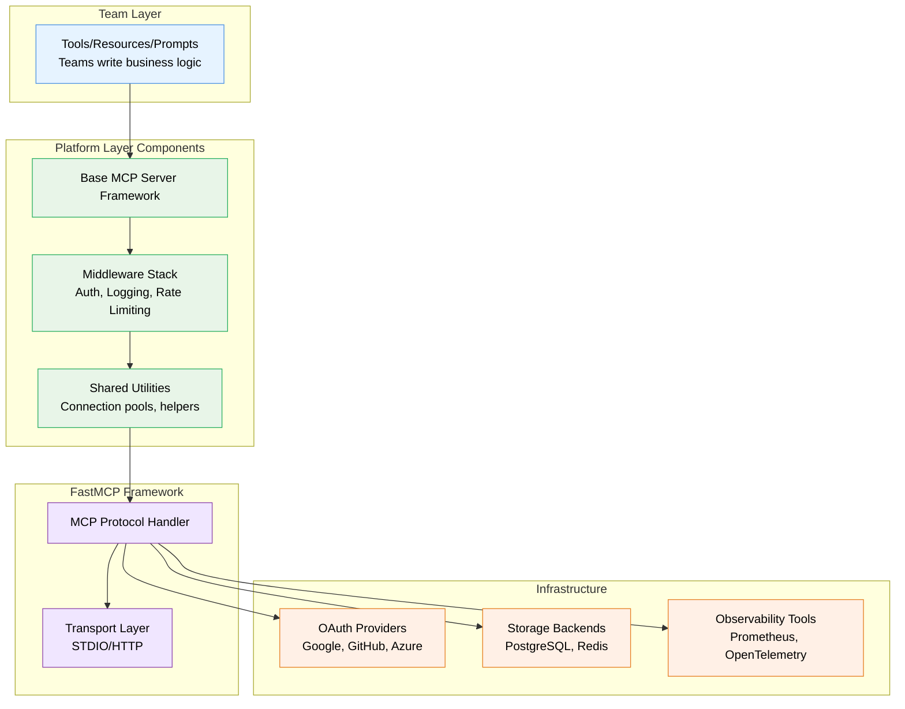

# FastMCP Platform Architecture Research & Reference Implementation

## Overview

This research project provides guidance for building foundational MCP (Model Context Protocol) components using FastMCP. The research analysed 42 sources including official documentation, production implementations, security articles, and real-world case studies to deliver actionable architectural recommendations.

**Research Question:** How should we design low-level, reusable MCP components that enable teams to build AI tools efficiently without reinventing infrastructure?

**Answer:** Use FastMCP's middleware-based architecture with server composition patterns, providing centralised cross-cutting concerns (auth, logging, error handling) while maintaining team flexibility.

---

## Research Deliverables

### 📋 For Stakeholders (Start Here)

**[Executive Summary](./reference/fastmcp-executive-summary.md)**
- Key findings and recommendations
- Business value and ROI
- Risk assessment
- Implementation roadmap (16 weeks, 3 phases)
- Key decisions needed

**Audience:** Technical leadership, product management, executive stakeholders

---

### 🏗️ For Engineering Team

**[Technical Architecture Document](./reference/fastmcp-technical-architecture.md)**
- Detailed component breakdown
- Core implementation patterns with runnable code
- Configuration, error handling, testing strategies
- Security model and authentication patterns
- Performance considerations
- Deployment patterns (Docker, Kubernetes)
- Comparison matrices for key decisions

**Audience:** Engineers implementing platform components

---

### 📚 For Development Teams

**[Patterns & Anti-Patterns Catalogue](./reference/fastmcp-patterns-anti-patterns.md)**
- Implementation patterns (when to use, trade-offs, code examples)
- Anti-patterns with refactoring approaches
- Severity ratings and prevention strategies
- Quick reference for common scenarios

**Audience:** Teams building MCP tools, code reviewers

---

### 🔍 For Deep Dive

**[Source Inventory & Research Methodology](./reference/fastmcp-architecture-research-references.md)**
- 42 sources catalogued with quality ratings (A/B+/B/C)
- Confidence levels for each finding (HIGH/MEDIUM/LOW)
- Research gaps identified
- Cross-reference matrix showing pattern consensus
- Detailed source annotations

**Audience:** Researchers, architects validating recommendations

---

## Quick Start Guide

### If You're a Stakeholder

1. Read [Executive Summary](./reference/fastmcp-executive-summary.md)
2. Review implementation roadmap
3. Prepare answers to "Questions for Discussion"
4. Schedule alignment meeting with engineering leadership

### If You're Building Platform Components

1. Read [Technical Architecture Document](./reference/fastmcp-technical-architecture.md)
2. Focus on "Component Breakdown" and "Implementation Patterns Catalogue"
3. Review comparison matrices for key decisions
4. Reference code examples for implementation

### If You're Building Tools on the Platform

1. Read relevant sections of [Patterns & Anti-Patterns Catalogue](./reference/fastmcp-patterns-anti-patterns.md)
2. Focus on "Must-Have Patterns"
3. Review anti-patterns to avoid common mistakes
4. Use as quick reference during development

---

## Research Methodology

### Approach

**4-Stage Process:**
1. **Discovery** - Identified and catalogued 42 sources
2. **Deep Analysis** - Extracted patterns and built comparison matrices
3. **Synthesis** - Developed architectural recommendations
4. **Client Packaging** - Created executive summary and deliverables

### Source Quality Distribution

- **A (Authoritative):** 11 sources - Official docs, protocol specs, primary repos
- **B+ (High-Quality Secondary):** 15 sources - Production guides, security implementations
- **B (Solid Secondary):** 12 sources - Best practices, architectural analyses
- **B-/C+ (Community):** 4 sources - Community implementations (variable quality)

### Confidence Levels

| Area                                          | Confidence      | Sources                       |
|-----------------------------------------------|-----------------|-------------------------------|
| Core API patterns, middleware, authentication | **HIGH**        | Official docs (A), 3+ sources |
| Production deployment, observability          | **MEDIUM-HIGH** | Mixed (A/B+), 2-3 sources     |
| Multi-tenancy, performance optimisation       | **MEDIUM**      | General patterns (B)          |
| Load testing, comprehensive anti-patterns     | **LOW-MEDIUM**  | Requires prototyping          |

---

## Key Findings Summary

### ✅ High-Confidence Recommendations

1. **Middleware-Based Architecture**
   - Handle authentication, logging, rate limiting, error handling uniformly
   - Proven pattern with multiple production examples
   - FastMCP-specific implementation (v2.9.0+)

2. **Server Composition for Modularity**
   - Mount or import domain-specific servers
   - Clear team boundaries, parallel development
   - Official FastMCP pattern with examples

3. **In-Memory Testing Standard**
   - FastMCPTransport enables fast tests (milliseconds)
   - 1000+ tests in FastMCP repo using this pattern
   - Critical for developer productivity

4. **Enterprise Authentication**
   - Built-in OAuth providers (Google, GitHub, Azure, WorkOS, Auth0)
   - Zero-config client experience
   - Production-ready token management

5. **Environment Variable Configuration**
   - 12-factor app pattern for cloud deployment
   - No secrets in code
   - Multiple environment support (dev/staging/prod)

### ⚠️ Medium-Confidence Areas (Require Prototyping)

1. **Multi-Tenancy Patterns**
   - Limited documented patterns in MCP context
   - Can adapt general multi-tenancy approaches
   - Recommend prototyping with pilot tenant

2. **Performance Optimisation**
   - No MCP-specific benchmarks available
   - General async Python patterns apply
   - Recommend early baseline measurements

3. **Load Testing Strategies**
   - Standard tools (k6, Locust) work but not MCP-specific guidance
   - Recommend establishing load testing approach early

### 🚧 Low-Confidence Areas (Research Gaps)

1. **Comprehensive Anti-Pattern Catalogue**
   - Limited documentation (one source with restricted access)
   - Extrapolated from general patterns and error types
   - Will emerge as teams build on platform

2. **Migration Tooling**
   - Framework still evolving (v2.x)
   - No established migration tools yet
   - Plan for manual migration with good docs

---

## Implementation Priorities

1. Must-Have (Phase 1)
   1. Middleware stack (auth, logging, error handling, rate limiting)
   2. In-memory testing harness
   3. Configuration management pattern
   4. Basic documentation and examples
2. Add As You Scale (Phase 2)
   1. Server composition patterns
   2. Caching middleware
   3. Observability integration
   4. Deployment templates (Docker, K8s)
3. Advanced (Phase 3)
   1. Circuit breaker and retry patterns
   2.  Advanced monitoring and alerting
   3.  Multi-tenancy support
   4.  Performance optimisation

---

## Architecture Overview

### Recommended Layered Architecture

**Key Principle:** Teams interact primarily with Platform Layer, which handles complexity of FastMCP and infrastructure.

---

## Risk Mitigation Summary

### Technical Risks

| Risk                     | Mitigation                                                     |
|--------------------------|----------------------------------------------------------------|
| FastMCP breaking changes | Pin versions, test before upgrading, maintain migration guides |
| Performance bottlenecks  | Benchmark early, optimise hot paths, provide caching           |
| Multi-tenancy complexity | Prototype early, thorough testing                              |
| Team adoption friction   | Comprehensive docs, templates, training                        |

### Organisational Risks

| Risk                        | Mitigation                                                 |
|-----------------------------|------------------------------------------------------------|
| Teams bypass platform       | Make platform easier than alternatives, enforce via review |
| Platform becomes bottleneck | Clear contribution process, empower teams                  |
| Over-engineering            | Follow YAGNI, validate with teams, iterative approach      |
| Inconsistent adoption       | Guidelines, templates, CI/CD enforcement                   |

---

## Success Metrics

### Quantifiable Metrics

- **Development Velocity:** Time to build first working tool (target: 30-50% reduction)
- **Code Quality:** Bug rates, code review comments (target: improve by 25%)
- **Security:** Security audit findings (target: 50% reduction in auth-related findings)
- **Onboarding:** Time to productivity for new engineers (target: reduce by 40%)

### Qualitative Metrics

- Developer satisfaction score (quarterly survey)
- Platform adoption rate (percentage of teams using platform)
- Contribution rate (teams contributing back to platform)

---

## Next Steps

### Current: Reference Implementation (In Progress)

Building a reference implementation package (`mcp-server-core`) that demonstrates the research findings:

**Phase 1: Core Package (`mcp-server-core/`)**
- [ ] Project scaffolding and directory structure
- [ ] Configuration management (Pydantic Settings, transport-aware logging)
- [ ] Transport-aware logging wrapper (STDIO vs HTTP)
- [ ] Observability integration (OpenTelemetry, Prometheus - optional)
- [ ] Security abstractions:
  - [ ] `URLFetcher` (SSRF prevention, rate limiting)
  - [ ] `FileOperations` (path traversal protection, safe permissions)
  - [ ] `CodeExecutor` (llm-sandbox integration)
- [ ] Base server class with lifecycle management
- [ ] Middleware configuration helpers

**Phase 2: Example Server (`example_server/`)**
- [ ] Reference implementation using `mcp-server-core`
- [ ] Example tools demonstrating security abstractions
- [ ] Comprehensive test suite (in-memory transport)
- [ ] Configuration examples (.env.example)
- [ ] Documentation and README

**Phase 3: Documentation**
- [ ] Package README with quick start
- [ ] API reference documentation
- [ ] Security best practices guide
- [ ] Deployment guide (STDIO vs HTTP)
- [ ] Testing patterns guide

**Key Principles:**
- Minimal dependencies (FastMCP + pydantic-settings)
- Leverage FastMCP's built-in features (logging, error handling, middleware, testing)
- Security-focused abstractions (prevent common vulnerabilities)
- Production-ready patterns (observability, configuration, testing)

**Location:** `/examples/` directory in this repository

### Future: Validation & Iteration

- [ ] Production deployment playbook
- [ ] Advanced patterns (circuit breaker, multi-tenancy)
- [ ] Observability integration
- [ ] Knowledge sharing and training

---

## Questions & Support

### For Questions About Research

- Review detailed source inventory for citations
- Check confidence levels for findings
- Identify research gaps if area not covered

### For Implementation Questions

- Reference technical architecture document for detailed guidance
- Use patterns catalogue for specific scenarios
- Check anti-patterns guide if encountering issues

### For Strategic Questions

- Review executive summary for business case
- Consult risk assessment for mitigation strategies
- Review implementation roadmap for timeline

---

## Research Limitations

### Acknowledged Gaps

1. **Performance Benchmarks:** No MCP-specific performance data available
2. **Multi-Tenancy:** Limited documented patterns specific to MCP
3. **Anti-Patterns:** One primary source with restricted access
4. **Load Testing:** General patterns need MCP-specific adaptation
5. **Migration Tooling:** Framework evolving, no established tooling

### Mitigation Approach

- Explicitly flag low-confidence areas in deliverables
- Recommend prototyping for uncertain patterns
- Plan for learning and iteration during implementation
- Document lessons learned for future teams

---

## Document Versions

| Document                 | Version | Last Updated    |
|--------------------------|---------|-----------------|
| Executive Summary        | 1.0     | 28 October 2025 |
| Technical Architecture   | 1.1     | 28 October 2025 |
| Patterns & Anti-Patterns | 1.0     | 28 October 2025 |
| Source Inventory         | 1.0     | 28 October 2025 |
| FastMCP Builtin Features | 1.0     | 28 October 2025 |
| CODE_REVIEW              | 1.1     | 28 October 2025 |
| README                   | 1.2     | 28 October 2025 |

**IMPORTANT: If you make ANY changes to these documents or if you add new documents you MUST update the version number and last updated date in this table!**

---

## Appendix: Quick Reference

### Key Patterns (Must-Have)

1. **In-Memory Testing:** Use `FastMCPTransport` for fast tests
2. **Middleware:** Handle cross-cutting concerns uniformly
3. **Context State:** Share auth/request data between middleware and tools
4. **Connection Pooling:** Create pools at startup, reuse across requests
5. **Environment Variables:** Externalise all configuration

### Key Anti-Patterns (Avoid)

1. **⚠️ AI Precision Anti-Pattern (CRITICAL):** Using LLMs for deterministic tasks (maths, validation)
2. **Fat Tool:** Tool with too many responsibilities (split into focused tools)
3. **God Server:** 50+ tools in one server (split into domain servers)
4. **Leaky Abstraction:** Bypassing platform layer (use provided abstractions)
5. **State Leakage:** Global variables (use Context for request state)
6. **Sync I/O:** `time.sleep()` in async (use `asyncio.sleep()`)
7. **Missing Cleanup:** No connection cleanup (use lifespan hooks)
8. **Hardcoded Config:** Secrets in code (use environment variables)

### Key Tools & Libraries

- **FastMCP:** Core framework
- **pytest:** Testing (use with `pytest-asyncio`)
- **httpx:** Async HTTP client (not `requests`)
- **asyncpg:** Async PostgreSQL (not `psycopg2`)
- **aiofiles:** Async file I/O (not `open()`)
- **pydantic:** Data validation
- **python-dotenv:** Load `.env` files
