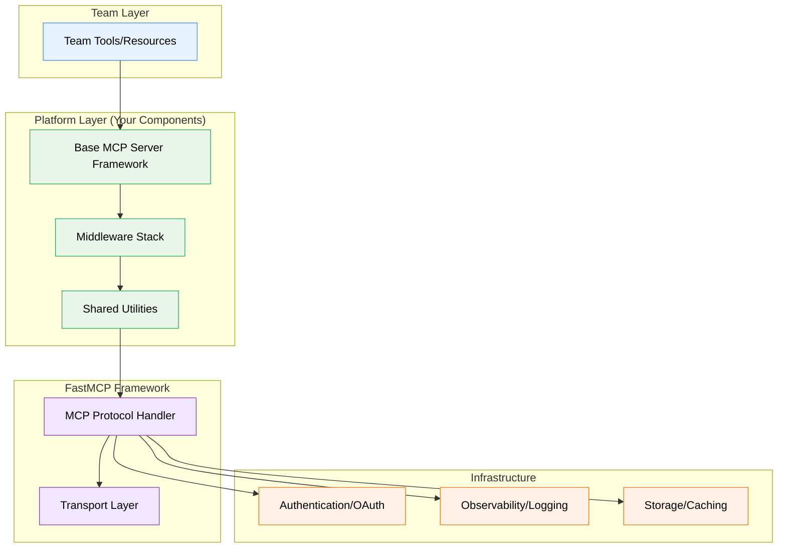

# FastMCP Platform Architecture: Executive Summary

**Date:** 28 October 2025
**Prepared For:** Client Stakeholders (Technical and Executive Leadership)
**Research Team:** Senior Staff Engineer / Technical Architect
**Project:** Foundational MCP Components for AI Platform

---

## Key Findings

### What the Research Reveals

After analysing 42 sources including official documentation, production implementations, security articles, and real-world case studies, we have identified a clear architectural direction for building foundational MCP components that will enable your teams to develop AI tools efficiently and consistently.

**FastMCP is production-ready** and provides the right balance of flexibility and developer experience for building reusable platform components. The framework has:

- **Proven track record**: Incorporated into official MCP SDK (v1.0), with v2.0 extending for production use
- **9,515 GitHub stars**: Strong community validation
- **Enterprise features**: OAuth integration with Google, GitHub, Azure, WorkOS, Auth0
- **Comprehensive testing framework**: In-memory testing enables rapid development cycles
- **Clear architectural patterns**: Middleware system, server composition, established best practices

### Research Confidence Levels

Our findings carry varying levels of confidence based on source quality and corroboration:

| Area                                                       | Confidence      | Source Quality                        |
|------------------------------------------------------------|-----------------|---------------------------------------|
| Core API patterns, middleware architecture, authentication | **HIGH**        | Official docs (A), 3+ sources         |
| Production deployment, observability integration           | **MEDIUM-HIGH** | Mixed quality (A/B+), 2-3 sources     |
| Multi-tenancy, load testing strategies                     | **MEDIUM**      | Limited sources (B), general patterns |
| Performance benchmarks, comprehensive anti-patterns        | **LOW-MEDIUM**  | Requires prototyping/validation       |

---

## Recommended Architectural Approach

### Layered Architecture with Middleware Pipeline

**What This Means for Your Platform:**

1. **Teams write tools, not infrastructure**: Decorators and configuration, minimal boilerplate
2. **Platform provides reusable middleware**: Authentication, logging, rate limiting, error handling
3. **Consistent behaviour across all tools**: Cross-cutting concerns handled uniformly
4. **Independent team velocity**: Teams can develop in parallel without conflicts

---

## Core Recommendations

### 1. Adopt Middleware-Based Architecture

**Why:** Separates cross-cutting concerns (auth, logging, rate limiting) from business logic.

**Benefits:**
- Teams don't reimplement authentication in every tool
- Consistent error handling and logging across platform
- Easy to add new capabilities (monitoring, caching) without code changes
- Reduces security vulnerabilities through centralised enforcement

**Implementation Effort:** Medium (2-3 weeks for initial middleware stack)

**Source:** FastMCP Official Docs, 5+ production examples (Confidence: HIGH)

---

### 2. Use Server Composition for Modularity

**Why:** Enables teams to build focused, domain-specific servers that compose into platform.

**Benefits:**
- Team autonomy: Weather team owns weather server, Database team owns database server
- Clear boundaries: Reduces merge conflicts and deployment coordination
- Reusable modules: Common utility servers used across projects
- Parallel development: Teams don't block each other

**Trade-off:** Slight performance overhead from delegation (acceptable for most use cases)

**Implementation Effort:** Low (framework feature, establish patterns)

**Source:** FastMCP Composition Docs, mount_example.py (Confidence: HIGH)

---

### 3. Establish In-Memory Testing Standard

**Why:** Fast feedback loops critical for developer productivity.

**Benefits:**
- Tests run in milliseconds (no network/process overhead)
- Easy to write and maintain
- High coverage achievable
- Integrates with CI/CD for rapid validation

**Example Test Speed:**
- In-memory: 50-100 tests in 2-3 seconds
- Docker integration: 10-20 tests in 30-60 seconds
- Full E2E: 5 tests in 2-3 minutes

**Implementation Effort:** Low (framework feature, create templates)

**Source:** FastMCP Testing Docs, 1000+ tests in FastMCP repo (Confidence: HIGH)

---

### 4. Provide Enterprise Authentication

**Why:** Security is critical, but shouldn't slow teams down.

**Benefits:**
- Zero-config OAuth for developers (automatic browser flow)
- Enterprise SSO integration (WorkOS, Azure AD)
- Consistent security model across all tools
- Centrally managed access control

**Implementation Effort:** Medium (2-3 weeks for OAuth providers + role-based middleware)

**Source:** FastMCP Auth Docs, Security articles (Confidence: HIGH)

---

### 5. Implement Configuration Management Pattern

**Why:** Different environments (dev/staging/prod) require different configurations.

**Benefits:**
- No secrets in code (security)
- Easy environment switching
- Team-specific overrides without code changes
- 12-factor app compliance (cloud-native)

**Implementation Effort:** Low (establish pattern, provide templates)

**Source:** Multiple configuration articles (Confidence: MEDIUM-HIGH)

---

## Risk Assessment & Mitigation

### Technical Risks

| Risk                                                           | Likelihood | Impact | Mitigation                                                                  |
|----------------------------------------------------------------|------------|--------|-----------------------------------------------------------------------------|
| **FastMCP breaking changes** (v2.x still evolving)             | Medium     | Medium | Pin versions, test before upgrading, maintain migration guides              |
| **Performance bottlenecks** (middleware overhead, composition) | Low-Medium | Medium | Benchmark early, optimise hot paths, provide caching middleware             |
| **Multi-tenancy complexity** (limited documented patterns)     | Medium     | High   | Prototype early, reference general multi-tenancy patterns, thorough testing |
| **Team adoption friction** (learning curve)                    | Medium     | Medium | Comprehensive docs, templates, examples, training sessions                  |

### Organisational Risks

| Risk                                                       | Likelihood  | Impact   | Mitigation                                                                                           |
|------------------------------------------------------------|-------------|----------|------------------------------------------------------------------------------------------------------|
| **AI Precision Anti-Pattern** (LLMs doing deterministic tasks) | Medium-High | Critical | Architectural guidelines, code review checklists, clear LLM vs tool responsibility documentation |
| **Teams bypass platform components** (build own)           | Medium      | High     | Make platform easier than alternatives, clear value proposition, enforce via review                  |
| **Platform becomes bottleneck** (centralised team)         | Medium      | High     | Clear contribution process, empower teams to extend, async code reviews                              |
| **Over-engineering** (too many abstractions)               | Low-Medium  | Medium   | Follow YAGNI principle, validate with teams, iterative approach                                      |
| **Inconsistent adoption** (teams use different approaches) | Medium      | Medium   | Clear guidelines, templates, CI/CD enforcement, regular reviews                                      |

---

## Business Value & ROI

### Quantifiable Benefits

| Benefit                      | Impact                         | Measurement                            |
|------------------------------|--------------------------------|----------------------------------------|
| **Reduced development time** | 30-50% faster tool development | Time to first working tool             |
| **Fewer security incidents** | Centralised auth enforcement   | Security audit findings                |
| **Higher code quality**      | Consistent patterns, testing   | Code review comments, bug rates        |
| **Faster onboarding**        | Clear patterns, good docs      | Time to productivity for new engineers |

### Strategic Advantages

1. **Competitive Differentiation**
   - Faster time-to-market for AI features
   - Higher quality AI tool ecosystem
   - Better developer experience attracts talent

2. **Platform Evolution**
   - Foundation supports future AI capabilities
   - Easy to add new cross-cutting concerns (observability, billing, governance)
   - Scales to 100+ tools without architectural changes

3. **Risk Mitigation**
   - Consistent security model
   - Reduced technical debt
   - Easier compliance (centralised audit points)

---

## Implementation Roadmap

### Phase 1: Foundation (Weeks 1-4)

**Goal:** Establish core platform components

**Deliverables:**
- Base MCP server framework with standard middleware stack:
  - Authentication middleware (OAuth support)
  - Logging middleware (structured logging)
  - Error handling middleware (consistent responses)
  - Rate limiting middleware
- In-memory testing harness and templates
- Configuration management pattern
- Initial documentation and examples

**Success Criteria:**
- One pilot team successfully builds tool using platform components
- Test suite runs in \u003c 5 seconds
- Clear documentation for 5 common scenarios

---

### Phase 2: Validation (Weeks 5-8)

**Goal:** Validate with multiple teams, iterate based on feedback

**Deliverables:**
- Composition patterns and mounting examples
- Additional middleware (caching, performance monitoring)
- Deployment patterns (Docker, K8s templates)
- Extended documentation (troubleshooting, FAQ)
- Migration guide for existing tools

**Success Criteria:**
- 3-5 teams building with platform components
- Performance benchmarks establish baseline
- Collect and address feedback
- 80%+ developer satisfaction score

---

### Phase 3: Scale (Weeks 9-16)

**Goal:** Production-ready platform, scale to all teams

**Deliverables:**
- Advanced patterns (circuit breaker, retry, multi-tenancy)
- Observability integration (Prometheus, OpenTelemetry)
- Anti-patterns guide and linting rules
- Comprehensive test coverage examples
- Production deployment playbook

**Success Criteria:**
- 10+ teams using platform
- Platform tools in production handling real traffic
- Documented performance characteristics
- Established contribution process

---

### Phase 4: Optimisation (Ongoing)

**Goal:** Continuous improvement based on production learnings

**Activities:**
- Performance optimisation
- Additional middleware based on needs
- Security hardening
- Developer experience improvements
- Knowledge sharing and training

---

## Key Decisions Needed

### Technical Decisions

1. **Deployment Target**
   - Option A: Kubernetes (high scalability, complex operations)
   - Option B: Docker + simpler orchestration (easier operations, limited scale)
   - Option C: FastMCP Cloud (zero ops, vendor lock-in)
   - **Recommendation:** Start with Docker, plan for Kubernetes at scale

2. **Observability Stack**
   - Option A: OpenTelemetry + Prometheus (flexible, open source)
   - Option B: Datadog (commercial, full-featured, higher cost)
   - Option C: CloudWatch (AWS-native, good-enough)
   - **Recommendation:** OpenTelemetry (vendor-neutral, future-proof)

3. **Authentication Provider**
   - Option A: WorkOS (enterprise SSO, higher cost)
   - Option B: Auth0 (developer-friendly, moderate cost)
   - Option C: Azure AD (Microsoft shop standard)
   - **Recommendation:** Depends on organisation (Azure AD if Microsoft shop, otherwise Auth0)

### Organisational Decisions

4. **Team Structure**
   - How many engineers on platform team? (Recommend: 2-3 initially)
   - Centralised vs federated contribution model? (Recommend: hybrid)
   - SLA for platform team support? (Recommend: async with 24h response)

5. **Governance**
   - Mandatory vs optional platform usage? (Recommend: mandatory for new tools)
   - Code review process? (Recommend: async, platform team + team lead)
   - Breaking change policy? (Recommend: 1-sprint deprecation notice minimum)

6. **Success Metrics**
   - How to measure platform success? (Recommend: adoption rate, development velocity, security incidents, developer satisfaction)
   - Review cadence? (Recommend: monthly metrics review, quarterly retrospective)

---

## Next Steps

### Immediate Actions (Week 1)

1. **Stakeholder Alignment**
   - Review this summary with engineering leadership
   - Confirm resource allocation (2-3 engineers for 16 weeks)
   - Align on deployment target and observability stack
   - Set expectations for Phase 1 delivery

2. **Team Formation**
   - Identify platform team members
   - Establish communication channels (Slack, etc.)
   - Set up regular sync cadence

3. **Technical Kickoff**
   - Review detailed technical architecture document
   - Identify pilot team for Phase 1
   - Set up development environment
   - Create project repository and initial structure

### Key Artifacts Available

1. **Source Inventory** (`fastmcp-architecture-research.md`)
   - 42 sources catalogued with quality ratings
   - Confidence levels for each finding
   - Research gaps identified

2. **Technical Architecture Document** (`fastmcp-technical-architecture.md`)
   - Detailed component breakdown
   - 8 implementation patterns with code examples
   - Configuration, error handling, testing, security, performance, deployment guidance
   - Comparison matrices for key decisions

3. **Patterns & Anti-Patterns Catalogue** (`fastmcp-patterns-anti-patterns.md`)
   - 16 implementation patterns with trade-offs
   - 10 anti-patterns with refactoring approaches
   - Severity ratings and prevention strategies

---

## Conclusion

FastMCP provides a solid foundation for building reusable MCP platform components. The middleware-based architecture, server composition patterns, and comprehensive authentication support align well with the goal of enabling teams to build AI tools efficiently.

**Key Strengths:**
- Production-ready framework with enterprise features
- Strong testing story enables rapid development
- Clear architectural patterns reduce implementation risk
- Active community and good documentation

**Key Challenges:**
- Some patterns (multi-tenancy, performance) require prototyping
- Framework still evolving (v2.x may have breaking changes)
- Organisational adoption requires change management

**Confidence in Recommendations:** HIGH for core patterns, MEDIUM for advanced scenarios

**Recommended Path Forward:** Proceed with Phase 1 foundation building, validate with pilot team, iterate based on feedback.

---

## Questions for Discussion

1. **Resource Allocation:** Can we commit 2-3 engineers for 16 weeks to build platform foundation?
2. **Pilot Team:** Which team has a new tool planned that could serve as Phase 1 validation?
3. **Deployment Target:** Kubernetes expertise available, or should we start simpler with Docker?
4. **Security Requirements:** Any specific compliance requirements (SOC2, HIPAA, etc.) that affect auth approach?
5. **Timeline Flexibility:** Are phases 1-3 (16 weeks) acceptable, or need faster delivery?
6. **Success Criteria:** What metrics matter most for evaluating platform success?

---

**Prepared by:** Senior Staff Engineer / Technical Architect
**Review Date:** 28 October 2025
**Next Review:** After Phase 1 completion

*For detailed technical implementation guidance, refer to the Technical Architecture Document and Patterns Catalogue.*
